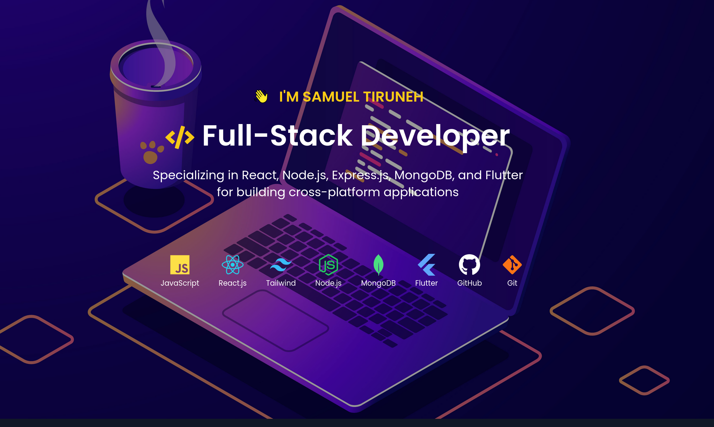

  

# ⚡ Contact Me 

  
  
   

  
  
  
  
  

## 🛠️ Skills

### Web Development

### Mobile Development

### Other Technologies

## 📈 GitHub Stats

## 🔥 Streak Stats

## 🏆 GitHub Trophies

## 📝 Latest Blog Posts

<!-- BLOG-POST-LIST:START -->
- [Post Title 1](Link)
- [Post Title 2](Link)
- [Post Title 3](Link)
<!-- BLOG-POST-LIST:END -->

## 🤝 Connect with Me

## 👀 Visitors Count

⭐️ From [YourName](https://github.com/yourusername)
